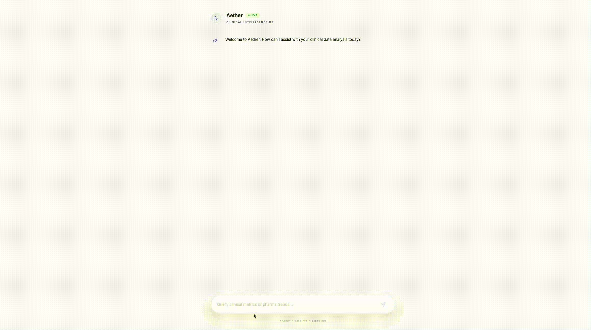
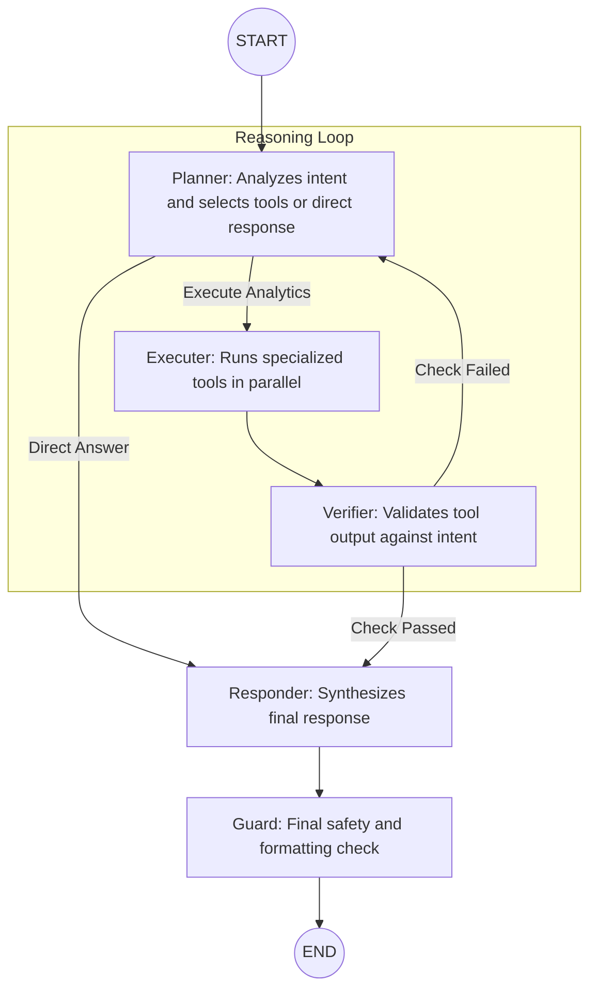

# Aether - Clinical Analyst

A sophisticated AI-powered pharmaceutical data analyst built with a multi-agent LangGraph backend and a modern Next.js frontend. This assistant provides deep insights into HCP performance, account metrics, and pharmaceutical market trends.



## Table of Contents
- [Tech Stack](#tech-stack)
- [Architecture](#architecture)
- [File Structure](#file-structure)
- [Toolbox](#toolbox)
- [Evaluation System](#evaluation-system)
- [Getting Started](#getting-started)
    - [Using Docker (Recommended)](#using-docker-recommended)
    - [Manual Setup](#manual-setup)

## Tech Stack

### Backend
| Technology | Description |
| :--- | :--- |
| **Python** | Core programming language |
| **FastAPI** | High-performance web framework for the API |
| **LangGraph** | Multi-agent workflow orchestration |
| **LangChain** | LLM framework and tool integration |
| **Gemini** | Google GenAI models (2.5-pro, 3-flash) |
| **DuckDB** | In-memory analytical database for SQL fallback |
| **FAISS** | Vector database for RAG capabilities |

### Frontend
| Technology | Description |
| :--- | :--- |
| **Next.js 15** | React framework with App Router |
| **Tailwind CSS** | Styling and layout |
| **Framer Motion** | Advanced UI animations |
| **Recharts** | Data visualization and charting |
| **Lucide React** | Premium icon set |

## Architecture

The backend utilizes a **LangGraph** agentic workflow to ensure high-quality, verified responses. The agent follows a structured cognitive loop designed for accuracy and safety.

### Agent Workflow


### Core Nodes
- **Planner Node**: The orchestration hub. It determines if a query requires data retrieval (tool calls) or can be answered directly.
- **Executer Node**: Handles parallel execution of tools (e.g., SQL lookups, RAG searches) to gather raw evidence.
- **Verifier Node**: A critical quality gate. It compares the raw evidence from the Executer against the user's original question to ensure logical consistency.
- **Responder Node**: Transforms raw data and reasoning into a polished, user-friendly Markdown response.
- **Guard Node**: Implements final guardrails to protect against hallucinations, off-topic content, or sensitive data disclosure.

## File Structure

```text
.
├── backend/
│   ├── api/            # FastAPI route definitions
│   ├── db/             # Database connectors and CSV loaders
│   ├── graph/          # LangGraph implementation (nodes, state, graph)
│   ├── tools/          # Specialized analytics tools (HCP, RX, Market)
│   ├── rag/            # RAG (Retrieval-Augmented Generation) logic
│   ├── eval/           # Comprehensive evaluation suite
│   ├── data/           # Raw CSV datasets
│   └── main.py         # Backend entry point
├── frontend/
│   ├── src/
│   │   ├── actions/    # Next.js Server Actions
│   │   ├── components/ # Reusable UI components
│   │   └── app/        # Page routes and global styles
│   └── package.json    # Frontend dependencies
└── docker-compose.yml  # Orchestration for the entire stack
```

## Toolbox

The agent has access to a comprehensive suite of pharmaceutical analytics tools:

| Category | Tools |
| :--- | :--- |
| **HCP Analysis** | `get_hcp_profile`, `get_hcp_rx_performance`, `get_hcp_ranking` |
| **Account Insight**| `get_account_profile`, `get_account_payor_mix`, `get_account_performance` |
| **Commercial Ops** | `get_rep_activity_summary`, `get_rep_performance`, `get_territory_summary` |
| **Market Intelligence** | `get_rx_trend`, `get_market_share_metrics`, `get_growth_analysis` |
| **Intelligence** | `search_doc` (RAG), `execute_safe_sql` (Fallback), `get_date_info` |

## Evaluation System

Aether includes a robust, 4-stage evaluation pipeline to ensure the agent's accuracy and reliability across various clinical and commercial scenarios.

| Stage | Process | Description |
| :--- | :--- | :--- |
| **1. Generation** | Question Synthesis | Programmatically generates ground-truth Q&A pairs directly from the source CSV data, ensuring 100% factual benchmarks. |
| **2. Collection** | System Inference | Battles-tests the live API by submitting the generated questions and capturing the agent's reasoning and final output. |
| **3. Grading** | LLM-as-a-Judge | Leverages a high-reasoning model (Gemini 3.1 Pro) to grade system responses against ground truth based on numerical precision and name accuracy. |
| **4. Reporting** | Performance Analysis | Aggregates scores and latencies into a detailed report, highlighting accuracy trends and failure modes for iterative improvement. |

## Getting Started

### Using Docker (Recommended)
The easiest way to run the project is using Docker Compose.

1.  **Configure Environment**:
    Ensure `backend/.env` exists with your `GOOGLE_API_KEY`.
2.  **Run Services**:
    ```bash
    docker-compose up --build
    ```
3.  **Access App**:
    - Frontend: `http://localhost:3000`
    - Backend API: `http://localhost:8000/docs`

### Manual Setup

#### Backend
1. `cd backend`
2. `python -m venv venv && source venv/bin/activate`
3. `pip install -r requirements.txt`
4. `python main.py`

#### Frontend
1. `cd frontend`
2. `npm install`
3. `npm run dev`
